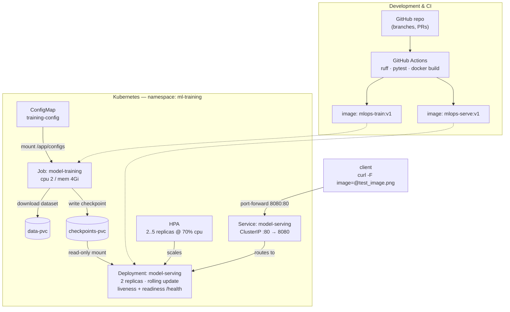

# mlops-pytorch-pipeline

A PyTorch image classifier (ResNet-18 on CIFAR-10) taken through the full
deployment lifecycle: local development, containerized training and serving
with Docker, and orchestrated training + serving on Kubernetes.

Training runs as a Kubernetes Job that writes a checkpoint to a persistent
volume; a 2-replica Deployment then serves predictions from that checkpoint
behind a ClusterIP Service, with a HorizontalPodAutoscaler for scale.

## Architecture



## Repository layout

```
src/                model.py, dataset.py, train.py, serve.py
configs/            training_config.yaml (hyperparameters)
docker/             Dockerfile.train (multi-stage), Dockerfile.serve (non-root + healthcheck)
k8s/                namespace, configmap, pvc, training-job, serving-deployment, serving-service, hpa
requirements/       pinned train.txt / serve.txt
tests/              test_model.py
.github/workflows/  ci.yml (ruff + pytest + docker builds)
```

## Prerequisites

- Python 3.10+
- Docker
- kubectl + a Kubernetes cluster (minikube, kind, or a managed cluster) for the deployment steps

## Quickstart (local)

```bash
python3 -m venv .venv
source .venv/bin/activate          # Windows: .\.venv\Scripts\Activate.ps1
pip install --upgrade pip
pip install -r requirements/train.txt -r requirements/serve.txt pytest

# run the tests
pytest tests/ -v

# train (writes ./checkpoints/classifier_v1.pt)
TRAINING_CONFIG=configs/training_config.yaml python src/train.py
```

ResNet-18 on CPU is slow (~15-20 min/epoch). For a quick smoke test, set
`architecture: simple_cnn` and `epochs: 2` in
[configs/training_config.yaml](configs/training_config.yaml); the rest of the
pipeline behaves identically.

Serve the trained model:

```bash
CHECKPOINT_PATH=checkpoints/classifier_v1.pt python src/serve.py
# then, in another shell:
curl http://localhost:8080/health
curl -X POST http://localhost:8080/predict -F "image=@test_image.png"
```

## Docker

```bash
mkdir -p data checkpoints

# training
docker build -f docker/Dockerfile.train -t mlops-train:v1 .
docker run --rm \
  -v $(pwd)/data:/app/data \
  -v $(pwd)/checkpoints:/app/checkpoints \
  -v $(pwd)/configs:/app/configs \
  mlops-train:v1

# serving
docker build -f docker/Dockerfile.serve -t mlops-serve:v1 .
docker run --rm -p 8080:8080 \
  -v $(pwd)/checkpoints:/app/checkpoints \
  mlops-serve:v1
```

The training image is multi-stage (dependencies built into a venv in the first
stage, only the venv copied into the runtime stage). The serving image installs
inference dependencies only, runs as a non-root user, exposes port 8080, and
declares a `HEALTHCHECK`.

## Kubernetes

Build the images and make them available to the cluster (minikube shown):

```bash
minikube image load mlops-train:v1
minikube image load mlops-serve:v1
```

Apply the training stack (order matters — the PVCs must exist before the Job):

```bash
kubectl apply -f k8s/namespace.yaml
kubectl apply -f k8s/pvc.yaml
kubectl apply -f k8s/configmap.yaml
kubectl apply -f k8s/training-job.yaml
kubectl logs -n ml-training -f job/model-training   # wait for checkpoint_saved
```

Once the Job reads `1/1` complete, deploy serving:

```bash
kubectl apply -f k8s/serving-deployment.yaml
kubectl apply -f k8s/serving-service.yaml
kubectl apply -f k8s/hpa.yaml

kubectl get pods -n ml-training
kubectl port-forward svc/model-serving 8080:80 -n ml-training
curl -X POST http://localhost:8080/predict -F "image=@test_image.png"
```

## Configuration

Hyperparameters live in [configs/training_config.yaml](configs/training_config.yaml)
(model architecture, epochs, batch size, learning rate, early-stopping patience,
dataset, and output paths). The training script resolves its config in this
order: `--config` flag, `TRAINING_CONFIG` env var, the ConfigMap mount at
`/app/configs/training_config.yaml`, then the baked-in default. On Kubernetes
the config is supplied by the `training-config` ConfigMap.

Secrets (kubeconfigs, keys, `.env`) are excluded via `.gitignore`; Kubernetes
secrets are created imperatively rather than committed — see
[k8s/secret.example.yaml](k8s/secret.example.yaml).

## Design notes

- The ResNet-18 stem is swapped to a 3x3 stride-1 conv with the max-pool
  removed, since the stock 7x7 stride-2 stem discards most spatial detail at
  32x32.
- `/health` returns 503 until the checkpoint finishes loading, which is what
  makes the Kubernetes readiness probe meaningful rather than cosmetic.
- The serving container runs as uid 1000, and the Deployment sets
  `runAsNonRoot` with a matching `fsGroup` for the read-only PVC mount.
- The PVCs are `ReadWriteOnce`, which is correct on single-node minikube/kind.
  A multi-node cluster would need a `ReadWriteMany` storage class for the
  checkpoints volume so the training Job and serving pods can share it.

## Continuous integration

[.github/workflows/ci.yml](.github/workflows/ci.yml) runs on every push and PR:
ruff lint, pytest, and both Docker image builds.
